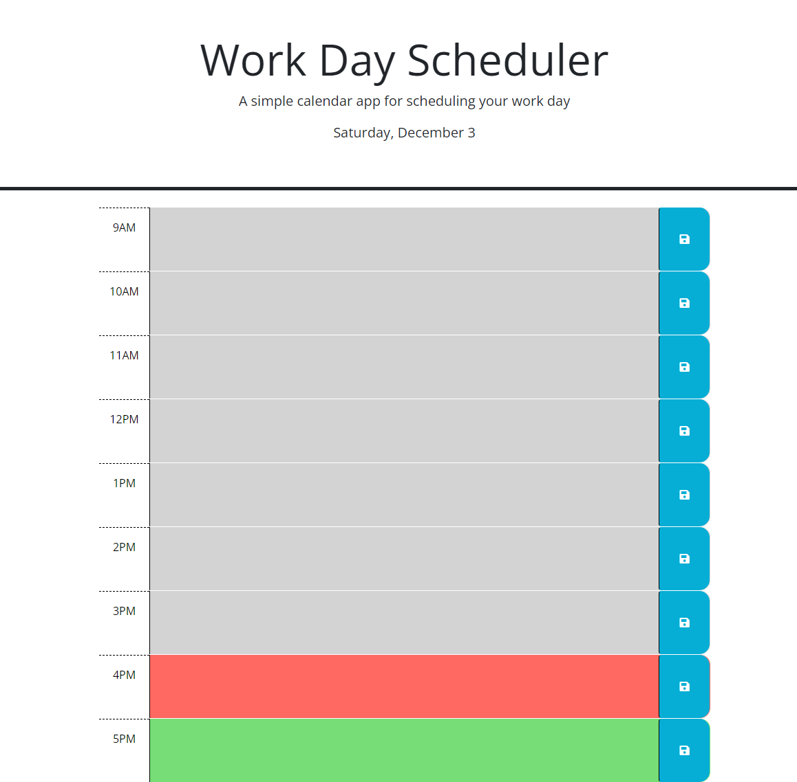

# Work-Day-Scheduler

## Description

```
A daily planner to create a schedule
The current day is displayed at the top of the calendar
Presenting with timeblocks for standard business hours
Each timeblock is color coded to indicate whether it is in the past, present, or future
Entering an event into a timeblock and save button for that timeblock
Event is saved in local storage so when refresh the page, the saved events persist

```

## Deployed Link

https://peterlim995.github.io/Work-Day-Scheduler/


## Screen Shot



